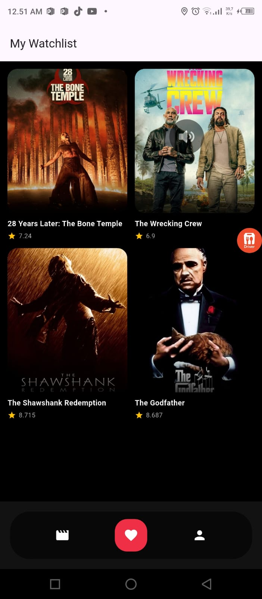
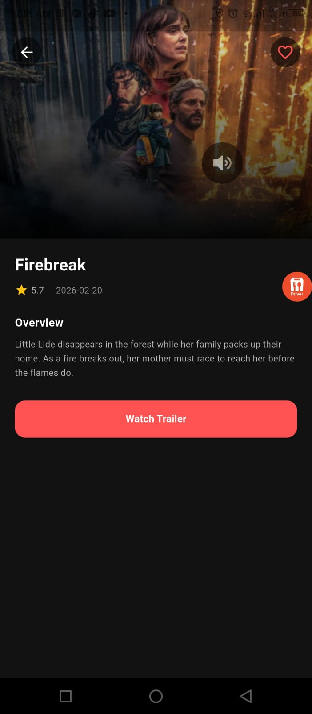

# 🎬 Flutter Movie App

A modern movie browsing application built with **Flutter**, powered by **TMDB API** and **Firebase**.

---

## 📌 Overview

Flutter Movie App is a clean and scalable movie application that allows users to:

- Browse trending movies
- Get personalized recommendations
- View movie details & trailers
- Save favorite movies
- Enjoy smooth animations and modern UI

Built using Flutter + GetX + Firebase + TMDB API.

---

## ✨ Features

### 🔐 Authentication
- Firebase Email & Password Authentication
- Splash → Login → Onboarding flow

### 🎭 Personalized Recommendation
- Genre selection during onboarding
- Recommended movies based on selected genres

### 🎥 Movie Sections
- 🔥 Trending Movies
- ⭐ Top Rated Movies
- 🎬 Now Playing Movies
- 📄 See All with Pagination
- 🔄 Pull to Refresh

### ❤️ Favorites
- Add / Remove favorite movies
- Firestore database integration
- Real-time UI updates
- Swipe to delete
- Grid layout (Netflix-style)

### 📄 Movie Detail
- Backdrop image
- Rating & release date
- Overview
- Watch trailer (YouTube)
- Add to favorites

### 🎨 UI / UX
- Clean dark theme
- Smooth splash animation
- Modern rounded cards
- Elegant horizontal carousels

---

## 🛠 Tech Stack

| Technology | Usage |
|------------|--------|
| Flutter | UI Framework |
| GetX | State Management & Routing |
| Firebase Auth | Authentication |
| Cloud Firestore | Database |
| TMDB API | Movie Data |
| URL Launcher | Open YouTube Trailer |
| Flutter Dotenv | Secure API Key |
| Shimmer | Loading Effects |

---

## 📸 Screenshots

<p align="center">
  
  
  
</p>
---

## 🔐 Environment Setup

Create a `.env` file in the root directory:

```
TMDB_API_KEY=your_api_key_here
```

Make sure `.env` is added to `.gitignore`.

---

## 🚀 Getting Started

### 1️⃣ Clone Repository

```
git clone https://github.com/IkhsanDs/flutter-movie-app.git
```

### 2️⃣ Install Dependencies

```
flutter pub get
```

### 3️⃣ Firebase Setup

- Add `google-services.json` to `android/app/`
- Add `GoogleService-Info.plist` to `ios/Runner/`

### 4️⃣ Run App

```
flutter run
```

---

## 📂 Project Structure

```
lib/
 ├── app/
 │   ├── modules/
 │   │   ├── auth/
 │   │   ├── home/
 │   │   ├── moviedetail/
 │   │   ├── favorite/
 │   │   ├── search/
 │   │   └── splash/
 │   ├── services/
 │   │   └── tmdb_service.dart
 │   ├── routes/
 │   └── theme/
```

---

## 📈 Architecture

- Feature-based modular structure
- GetX controller-based state management
- Reactive UI using Obx()
- Separation between services, modules, and UI

---

## 🔥 Roadmap

- [x] Authentication
- [x] Genre-based Recommendation
- [x] Favorites with Firestore
- [x] Pagination (See All)
- [ ] Light / Dark Mode Toggle
- [ ] More Animations
- [ ] App Store Release

---

## 👨‍💻 Author

Ikhsan Dwi Seto

---

## 📄 License

This project is built for learning and portfolio purposes.
